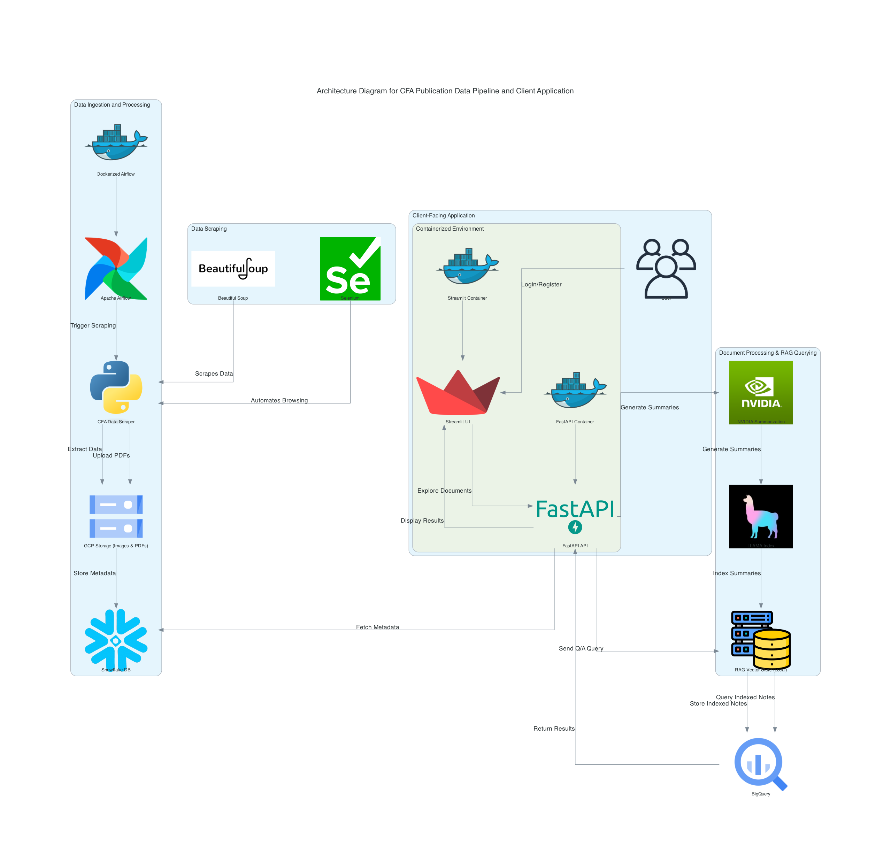

# Assignment-3

## Problem Statement
Enterprises rely on vast amounts of publication data across various domains to drive strategic initiatives, inform decision-making, and maintain a competitive edge. However, these valuable insights are often embedded within unstructured data formats, requiring significant manual effort to extract and analyze relevant information. This project addresses the need for an automated solution to ingest, process, and summarize publication data, enabling enterprises to streamline information access, improve operational efficiency, and focus on deriving actionable insights without the burden of sifting through extensive, unstructured content.

## Project Summary
This project automates the data ingestion, storage, and analysis of publications from the CFA Institute Research Foundation. The pipeline utilizes web scraping to extract publication metadata and files, uploads files to Google Cloud Storage (GCS), and loads data into Snowflake for structured querying. A FastAPI-based backend is developed to serve summaries of documents, and Streamlit is used for the front end, allowing users to explore and interact with these publications. NVIDIA AI models provide on-the-fly summarization and Q/A capabilities.

## Technologies Used
[](https://github.com/)
[](https://www.python.org/)
[](https://cloud.google.com)
[](https://streamlit.io/)
[](https://fastapi.tiangolo.com/)
[](https://www.docker.com/)
[](https://airflow.apache.org/)
[](https://cloud.google.com/bigquery)
[](https://www.snowflake.com/)
[](https://llamaindex.ai/)
[](https://www.selenium.dev/)
[](https://www.crummy.com/software/BeautifulSoup/)
[](https://developer.nvidia.com/apis)

## Live application Links
- Streamlit app: https://streamlit-app-us-central1-project3-439417.a.run.app
- FastAPI Link: https://project3-439417.appspot.com

## Background
The project focuses on implementing a comprehensive pipeline to automate data ingestion and analysis for CFA Institute publications. The pipeline also includes advanced query and summarization features using state-of-the-art machine learning models. This approach allows users to efficiently search and extract insights from large volumes of textual data.

## Proof of Concept (PoC)
The PoC involved creating a minimal version of the pipeline, which included scraping a subset of CFA publications, uploading documents to GCS, and populating Snowflake with metadata. A simple FastAPI service was deployed to test document retrieval and summarization using NVIDIA’s AI models, and a basic Streamlit interface was created for document interaction.

## Project Goals
1. **Automate Data Ingestion**: Set up a pipeline to scrape CFA publications, upload files to GCS, and store metadata in Snowflake.
2. **Develop Backend Services**: Build a FastAPI application to serve data and enable on-the-fly summaries and Q/A using NVIDIA APIs.
3. **Build a User Interface**: Create a Streamlit-based front end to allow users to browse, summarize, and interact with publications.
4. **Implement Search Functionality**: Enable users to query and retrieve relevant information using multi-modal RAG for targeted insights.

## Architecture Diagram
  

## Project Structure
1. **Part 1: Data Ingestion and Database Population**
   - **Data Scraping**: Scrapes titles, images, summaries, and PDF files from CFA publications.
   - **Data Storage**: Uploads images and PDFs to GCS and stores metadata in Snowflake.
   - **Airflow Pipeline**: Automates the data ingestion, uploading, and loading processes.

2. **Part 2: Client-Facing Application (FastAPI + Streamlit)**
   - **FastAPI**:
     - Provides an API to explore documents.
     - Implements on-the-fly summarization using NVIDIA models.
     - Enables Q/A with multi-modal RAG.
   - **Streamlit**:
     - Provides a front-end interface for document browsing and interaction.
     - Supports dropdown and grid selection for easy navigation.

3. **Part 3: Research Notes Indexing and Search**
   - **Incremental Indexing**: Indexes research notes for each document to support targeted searching.
   - **Search Functionality**: Allows users to query research notes and document content based on specific questions.

## Pre-requisites
- Python 3.8 or higher
- Google Cloud credentials with permissions for GCS
- NVIDIA API access key
- Snowflake account credentials
- Docker (for containerization and deployment)

## How to Run the Application Locally

### Prerequisites
- Docker and Docker Compose installed on your machine.
- Configure your `.env` file with the required credentials and configuration values, including Snowflake, GCS, and NVIDIA API keys.

### Step 1: Set Up Dockerized Environment
1. **Clone the Repository**
   ```bash
   git clone https://github.com/your-repo-name.git
   cd your-repo-name
   ```

2. **Environment Configuration**
   - Ensure `.env` is correctly set up with environment variables for Snowflake, GCS, NVIDIA API keys, and other necessary credentials.

3. **Start Docker Containers**
   - Build and start the Docker containers, including Airflow, FastAPI, and Streamlit.
   ```bash
   docker-compose up --build
   ```

### Step 2: Start Airflow (for Data Ingestion)
1. Access Airflow:
   - Once the containers are running, open Airflow's UI by visiting `http://localhost:8080`.
   - Login using the default credentials (`airflow`/`airflow` unless otherwise configured).
   - Ensure Firefox is installed as this selenium scrapper code uses the Firefox browser for scraping.
   - Update configurations and system paths in docker-compose.yml and Dockerfile.
2. Trigger DAG:
   - In the Airflow UI, start the data ingestion DAG to begin scraping publications and uploading images/PDFs to GCS, and populate the Snowflake database.

### Step 3: Start FastAPI and Streamlit Applications
1. **FastAPI**
   - FastAPI will automatically run as a service within Docker. Access it by navigating to `http://localhost:8000/docs` to view the API documentation and test endpoints.
2. **Streamlit**
   - Streamlit will also run as a Docker service, accessible at `http://localhost:8501`.
   - Use the Streamlit UI for document selection, summary generation, and Q/A interactions.

### Step 4: Stop the Application
- When you’re done, stop the containers:
  ```bash
  docker-compose down
  ```

## Codelab Link
[Codelab Documentation](https://codelabs-preview.appspot.com/?file_id=https://docs.google.com/document/d/1YDpvSLUeodt7lW3ZT-wVSmbLw3S-tq2ce6TNO6etmL0/edit?tab=t.0#0)

## Demo Video
[Project Demo Video](https://your-demo-video-url.com)


## References
1. **CFA Institute Publications**  
   [CFA Institute Research Foundation](https://rpc.cfainstitute.org/en/research-foundation/publications#sort=%40officialz32xdate%20descending&f:SeriesContent=[Research%20Foundation]) - Provides the source for financial publications used in this project.
2. **NVIDIA Triton Inference Server Documentation**  
   [NVIDIA Triton Inference Server](https://docs.nvidia.com/deeplearning/triton-inference-server/user-guide/docs/index.html) - Documentation on deploying AI models at scale with NVIDIA's Triton Inference Server.
3. **LLAMA Multi-modal RAG Example**  
   [LLAMA Multi-modal RAG Example](https://github.com/run-llama/llama_parse/blob/main/examples/multimodal/multimodal_rag_slide_deck.ipynb) - An example repository demonstrating retrieval-augmented generation using LLAMA for multimodal data.
4. **Google Cloud Storage Documentation**  
   [GCS Documentation](https://cloud.google.com/storage/docs) - Learn about Google Cloud Storage services used to store and access PDF and image files for the project.
5. **Snowflake Database Documentation**  
   [Snowflake Documentation](https://docs.snowflake.com/) - Official documentation for working with Snowflake databases, covering ingestion, storage, and data retrieval techniques.
6. **FastAPI Framework Documentation**  
   [FastAPI Documentation](https://fastapi.tiangolo.com/) - Details on the FastAPI framework used for the backend API, including deployment, security, and best practices.
7. **Streamlit Documentation**  
   [Streamlit Documentation](https://docs.streamlit.io/) - Guides on creating interactive front-end applications with Streamlit, focused on user experience and seamless deployment.
8. **Apache Airflow Documentation**  
   [Airflow Documentation](https://airflow.apache.org/docs/) - Documentation for orchestrating data workflows, scheduling, and integrating automated data pipelines using Apache Airflow.
9. **PyMuPDF (fitz) Documentation**  
   [PyMuPDF Documentation](https://pymupdf.readthedocs.io/en/latest/) - Comprehensive guide on working with PDFs, including text extraction, which is crucial for processing documents in the pipeline.
10. **NVIDIA NGC Models - Meta LLAMA Model**  
   [Meta LLAMA on NVIDIA NGC](https://catalog.ngc.nvidia.com/orgs/nvidia/teams/nemo/models/llama-3_1-70b-nemo) - Information on the meta LLAMA models, which are used for generating summaries and Q/A processing.
11. **Docker Documentation**  
   [Docker Documentation](https://docs.docker.com/) - Detailed instructions on containerizing applications, managing multi-container applications with Docker Compose, and deploying scalable services.
12. **Beautiful Soup Documentation**  
   [Beautiful Soup Documentation](https://www.crummy.com/software/BeautifulSoup/bs4/doc/) - Library documentation for web scraping, used to extract and clean data from HTML pages.
13. **Selenium WebDriver Documentation**  
   [Selenium Documentation](https://www.selenium.dev/documentation/webdriver/) - Provides documentation on browser automation with Selenium, useful for more complex scraping tasks.


   ## Team Contributions
| Name                        | Contribution % | Contributions                                                                                    |
|---------------------------  |----------------|--------------------------------------------------------------------------------------------------|
| Sai Pranavi Jeedigunta      | 33%            | Data Ingestion, Database Population, Pipeline Automation, Summarization in FastAPI backend       |
| Akanksha Pandey             | 33%            | Implemented FastAPI backend for RAG along with research notes indexing                           |
| Kalash Desai                | 33%            | Created Streamlit frontend, developed API for docs explore and selection and integrated services |

---

## **Attestation and Contribution Declaration**:
   > WE ATTEST THAT WE HAVEN’T USED ANY OTHER STUDENTS’ WORK IN OUR ASSIGNMENT AND ABIDE BY THE POLICIES LISTED IN THE STUDENT HANDBOOK.
